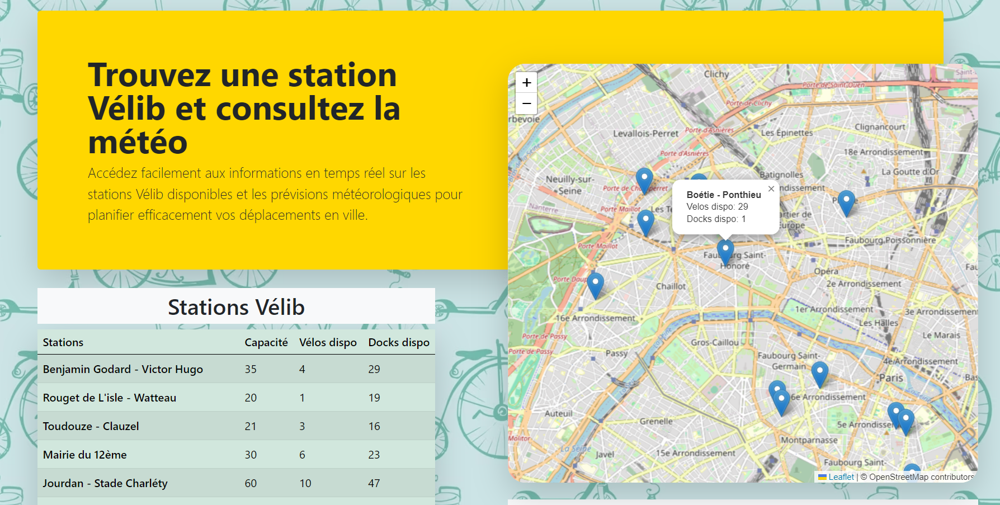
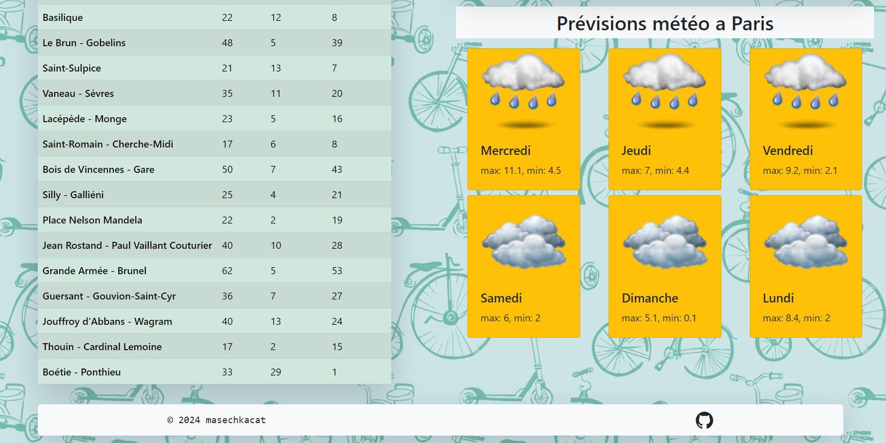

# Vélib Station and Weather Information Project

[](https://leafletjs.com/)
[](https://opendata.paris.fr/)
[](https://open-meteo.com/)


## Description

This project is an interactive web page that displays real-time information about the availability of Vélib bikes in Paris as well as current weather conditions. The project leverages three open APIs:

- Leaflet for map visualization
- Open Data Paris for Vélib station information
- Open-Meteo for weather forecasting

The page dynamically updates to reflect the latest available bikes and docking stations, as well as weather updates for the selected location.

## Technologies

- Vanilla JavaScript for handling requests and data processing
- Fetch API for HTTP requests
- Leaflet for map visualization and popup creation
- Open Data Paris and Open-Meteo APIs for data retrieval

## Usage

Open the page to see a map marked with available Vélib stations and the current weather. Data is refreshed every hours using `setInterval()` to ensure the latest station availability and weather conditions are reflected.

## Demo




## Installation

To run the project locally, clone the repository and open `index.html` in your browser.

```
git clone https://github.com/masechkacat/InfoVelo.git
```

## Contributing

If you would like to contribute to the project, please discuss the changes you wish to make via issues before making a pull request.
